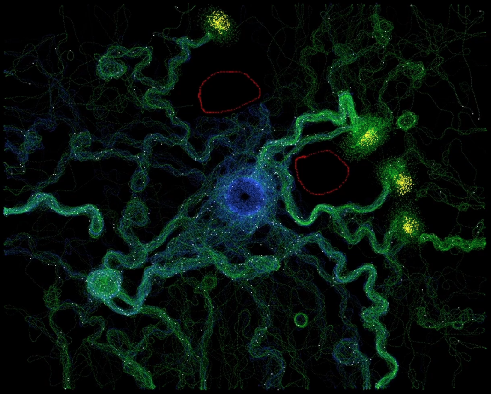
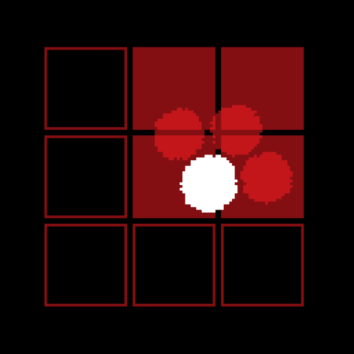
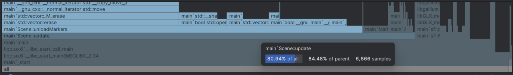

>[github.com/will-pettifer/AntSim](https://github.com/will-pettifer/AntSim)
- [Navigation](#navigation)
- [Pheromone Grid](#pheromone-grid)
- [Vectors](#vectors)
- [Reflections](#reflections)

---

This project was made using SFML and OpenMP. It simulates an ant colony, where ants leave their nest, search for food while depositing pheromones, and then use those pheromones to find a way home. This project was a great introduction to parallel programming, but more importantly it was the first time I had finished a project in C++.

The main challenge was improving performance. There are a number of optimisations I had to make, which forced me to learn a lot more about C++. I profiled using Nsight Graphics, Massif, and Perf.



### Navigation
For the ants to choose a direction, they search three zones in front of them for pheromones and the pick the direction with the most. My initial approach had been to get every ant to check every pheromone every frame, which of course was extremely slow.  The first optimisation was to get the ants to check only at set intervals, and to then randomly offset these intervals on construction:

```c++
Ant::Ant(const sf::Vector2f position) {  
    this->position = position;  
    direction = Random::OnUnitCircle();  
    velocity = Random::OnUnitCircle();  
    state = FOOD;  
    timer = Random::Float(0, MARKER_INTERVAL);  
    frameTimer = Random::Float(0, UPDATE_INTERVAL);  
}
```

### Pheromone Grid
Next, I implemented a grid for the pheromones, meaning that the ants only had to check a very small number of pheromones each frame. To do this, I stored each marker in a 2D-array of vectors of shared-pointers:

```c++
vector<shared_ptr<Marker>> foodMarkerGrid[128][72];

void Scene::loadFoodMarker(sf::Vector2f pos) {  
    if (pos.x < 0 || pos.x > 1280 || pos.y < 0 || pos.y > 720) return;  
    const auto posi = static_cast<sf::Vector2u>(pos / 10.f);  
  
    #pragma omp critical  
    {  
        int gridId = foodMarkerGrid[posi.x][posi.y].size();  
        int id = foodMarkers.size();  
  
        const auto ptr = make_shared<Marker>(pos, Marker::Food, id, gridId);  
        foodMarkerGrid[posi.x][posi.y].push_back(ptr);  
        foodMarkers.push_back(ptr);  
    }
}
```

I then used the ant's position to find the surrounding 9 cells, and then AABB-sphere collision detection to search only the overlapping cells:



This led to a huge performance increase, and it meant that the bottle-neck was now simply the unloading and loading of the markers:



### Vectors
This was my favourite part of the project because it taught me more about C++. My first idea was to use `vector.erase()`, which has O(n) complexity, as every item in the vector must be checked, and then moved back:

```c++
if (marker->type == Marker::Food) {
    auto& cell = foodMarkerGrid[pos.x][pos.y];
    cell.erase(std::remove(cell.begin(), cell.end(), marker), cell.end());
}
```

As lists are collections of linked nodes rather than a contiguous block of memory, they are faster here as the elements don't need to be moved back when one is removed. However, the complexity is still O(n):

```c++
for (auto it = homeMarkers.begin(); it != homeMarkers.end(); ++it) {
    if (*it == marker) {
        homeMarkers.erase(it);
        break;
    }
}
```

Finally, I switched back to vectors. I stored grid IDs on the markers so that I could search for them without iterating through every element. I then used 'swap and pop' to remove the marker without moving every element in the vector, which finally had a complexity of O(1):

```c++
if (marker->type == Marker::Food) {  
    foodMarkers[id].swap(foodMarkers.back());  
    foodMarkers[id]->id = id;  
    foodMarkers.pop_back();  
  
    auto& cell = foodMarkerGrid[pos.x][pos.y];  
    cell[gridId].swap(cell.back());  
    cell[gridId]->gridId = gridId;
}
```

### Reflections
This has been a thoroughly enjoyable project; I found writing in C++ to be engaging and exciting. I only wish I could spend more time working with this language. In fact, revisiting this project to write this page has really got me excited for my next project, which will, God willing, be written in C++ and implement Vulkan.

There were definitely points that could have been improved, but mostly the lack of polish comes from my lack of experience with C++, hence my excitement to get into it more.
