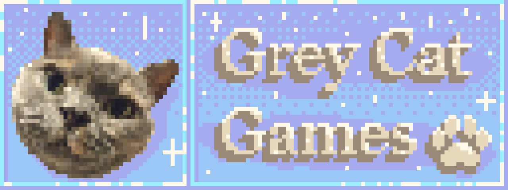

>[linkedin.com/company/greycatgames](https://uk.linkedin.com/company/greycatgames)

Grey Cat Games Ltd is a company three other developers and I set up. We are currently working on our first title, *Spindraw*. Our team is made up of two programmers, one designer, and I am the artist. My role includes:

- Creating promotional materials for the game and company
- Directing the visual style of the game
- Creating game assets
- Implementing those assets in Unity

Assets are primarily made in Blender, and their albedo textures are made in Aseprite to facilitate the game's low-poly, pixel-art aesthetic.