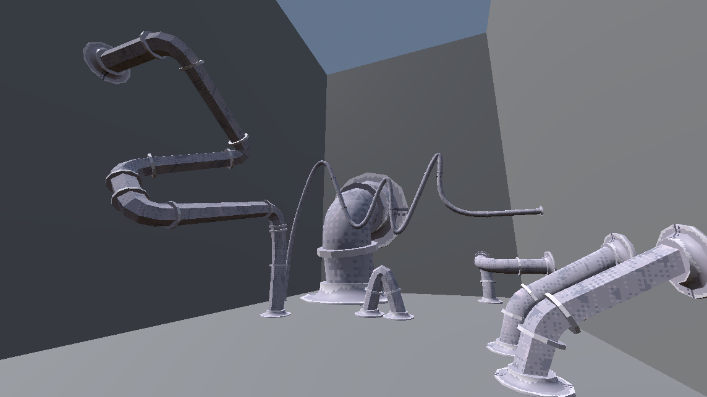
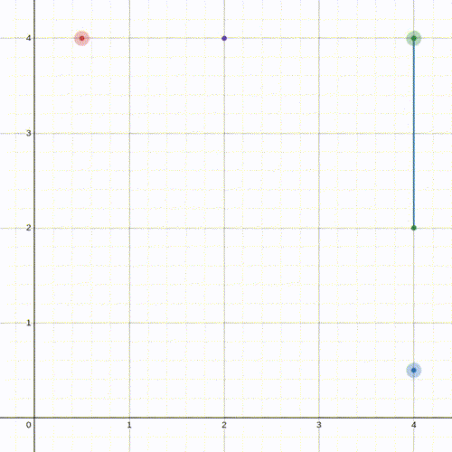
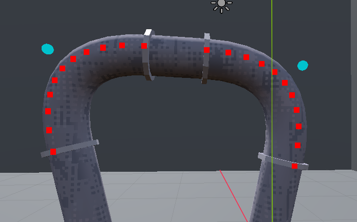
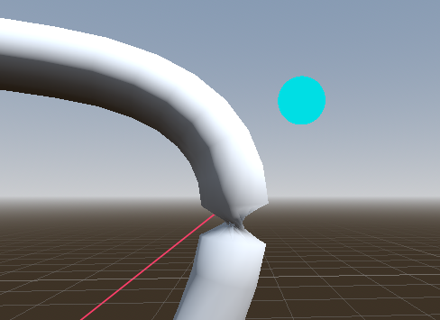

>[github.com/will-pettifer/pipeworks](https://github.com/will-pettifer/pipeworks)

This project is a tool for the Godot Engine that lets developers place decorative pipes using control nodes and a custom `PipeSpline` class.

The `PipeSpline` class has the tag `@tool`, which Godot uses to define editor tools where the `_process()` method is called during editor time as well as runtime. The resulting `PipeSpline` node uses child control points to draw out a spline with bezier curves for the corners. each vertex of this spline is then used to generate a tube mesh, then models are loaded at the ends of the straight sections to represent connection points in the pipe.

<iframe class="video-container" height="427" src="https://www.youtube.com/embed/Yt1ps1tJKjI" title="pipeworks-demo" frameborder="0" allow="accelerometer; autoplay; clipboard-write; encrypted-media; gyroscope; picture-in-picture; web-share" referrerpolicy="strict-origin-when-cross-origin" allowfullscreen></iframe>

## Bezier Curve
The bezier curve was very simple to implement. To begin with, the directions to the next and previous control points on the spline are taken, then normalised, then scaled up by a float that is exposed to the Godot editor using the `@export` tag, so the radius of the curve can easily be edited. A series of steps are generated according to another exported integer, then iterated through to find vertices on a line between these two direction vectors as they are scaled inversely to each other:



The resulting vertices shown over the final mesh:


## Parallel Transport

To generate the mesh, rings of vertices need to be generated around each spline vertex. To generate the rings, a vector normal perpendicular to the tangent of the vertex needs to be computed. There are infinite vectors that fulfil this condition, so there needs to be a proper reference for the frame. The simplest approach is to take the cross product of $\hat{j}$ and the tangent. However, the cross product is defined as $a \times b = \lVert a \lVert \lVert b \lVert sin(\theta)n$ , meaning that if the angle between the two vectors is 0, then the resulting vector is $\vec{0}$. This demonstrates one of the weaknesses of this naive approach. The resulting cross product becomes numerically unstable as the tangent approaches the reference vector. Another naive solution is to simply put in a conditional such that the program uses a different reference, e.g. $\hat{i}$ in the case that the tangent and the reference are too close. This still creates a sharp transition when passing near the reference, like when the pipe is snaking upwards and then around, which causes the resulting mesh to twist suddenly:



Rather than use a global reference frame to define a local property, the most appropriate solution is to use parallel transportation. This approach propagates the orientation of the frame incrementally along the spline. To do this, an initial reference is chosen, and then the rotation from one tangent to the next is calculated, and the reference is rotated by the same amount. This creates frames with continuity, and the resulting mesh is geometrically robust and without artefacts:

```python
var normals := []
var binormals := []

for i in spline_vertices.size():
	
	# Compute the initial frame
	if i == 0:
		var t0 = tangents[0]
		var n0 = t0.cross(Vector3.UP)
		if n0.length() < 0.001:
			n0 = t0.cross(Vector3.RIGHT)
		
		var b0 = t0.cross(n0).normalized()
		
		normals.append(n0.normalized())
		binormals.append(b0.normalized())
		
		continue
	
	var t_prev = tangents[i - 1]
	var t_curr = tangents[i]
	
	# If the tangents are similar, maintain the reference
	var axis = t_prev.cross(t_curr)
	if axis.length() < 0.0001:
		normals.append(normals[i - 1])
		binormals.append(binormals[i - 1])
		continue
	axis = axis.normalized()
	
	# Compute the angle from one to the next
	var angle := acos(clamp(t_prev.dot(t_curr), -1.0, 1.0))
	
	# Rotate the previous reference by that angle
	var rot := Basis(axis, angle)
	
	var n = rot * normals[i - 1]
	var b = t_curr.cross(n).normalized()
	
	normals.append(n)
	binormals.append(b)
```

## Reflections
This project was interesting to engage with as there were several problems that cropped up during development, such as issues with the correct way to load and cache scenes given the `@tool` tag, or the problem of mesh twisting as discussed above. Solving these problems taught me more about the Godot Engine and procedural geometry more generally. My intention is to build similar tools and use them for indie projects in the future, and this project serves that purpose well.