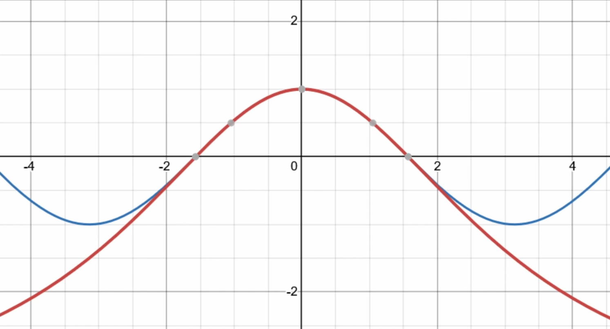

# !!! WIP !!!

>[github.com/will-pettifer/SpaceDogFight](https://github.com/will-pettifer/SpaceDogFight)
>
>Maths: </br>
>&nbsp;&nbsp;&nbsp;⚘ [Sine](#sine) </br>
>&nbsp;&nbsp;&nbsp;⚘ [Vectors and Matrices](#vectors-and-matrices) </br>
>&nbsp;&nbsp;&nbsp;⚘ [Quaternions](#quaternions) </br>
>
>Physics: </br>
>&nbsp;&nbsp;&nbsp;⚘ [Pheromone Grid](#pheromone-grid) </br>
>&nbsp;&nbsp;&nbsp;⚘ [Reflections](#reflections)
>
>Rendering: </br>
>&nbsp;&nbsp;&nbsp;⚘

This project was made using OpenGL/OpenTK and was written in C#. It includes basic 3D rendering and a physics engine. My aim with this project was to better understand the maths behind games and 3D rendering, so I avoided using external maths libraries. This meant I had to implement vectors, matrices, quaternions, and even my own sine function.

# Maths
### Sine
I reviewed a few different options for this, such as a Taylor series or a CORDIC algorithm, but in the end I decided this would be the simplest. I used Bhāskara I's sine approximation, which is a really simple formula:

$$
sin(x)\approx\frac{16x(\pi-x)}{5\pi^2-4x(\pi-x)}
$$

Or for cosine:

$$
cos(y)\approx\frac{\pi^2-4y^2}{\pi^2+y^2}
$$

This produces this graph, where blue is $cos(x)$, red is the formula:



Which can then be translated to account for the lack of repetition in the curve:

```csharp
public static float Sin(float rad) => Cos(rad - TauOver4);
public static float Cos(float rad)
{
    rad %= Tau;
    rad = Abs(rad);
    
    int sign = 1;
    switch (rad)
    {
        case < TauOver4:
            break;
        case < Pi:
            sign = -1;
            rad = TauOver4 - (rad - TauOver4);
            break;
        case < Tau3Over4:
            sign = -1;
            rad -= Pi;
            break;
        case <= Tau:
            rad = Pi - (rad - Pi);
            break;
    }
    return sign * ((PiSqr - 4 * rad * rad) / (PiSqr + rad * rad));
}
```

### Vectors and Matrices
I decided to store matrices by their columns rather than by their rows:

```csharp
public class Mat4
{
    public Vec4 C0, C1, C2, C3;
    ...
}
```

 made the multiplication very simple:

```csharp
public static Mat3 operator *(Mat3 b, Mat3 a)
    => new(b.C0 * a, b.C1 * a, b.C2 * a);
public static Vec3 operator *(Vec3 v, Mat3 m)
    => v.X * m.C0 + v.Y * m.C1 + v.Z * m.C2;
```

I also implemented a function to invert 3x3 matrices by finding the determinant of the minor of each element, changing the signs, transposing it, and then dividing by the determinant:

```csharp
public Mat3 Inverse()
{
    float[,] matTemp =
    {
        { C0.X, C0.Y, C0.Z },
        { C1.X, C1.Y, C1.Z },
        { C2.X, C2.Y, C2.Z }
    };
    float[,] result =
    {
        { 0, 0, 0 },
        { 0, 0, 0 },
        { 0, 0, 0 }
    };
    for (int c = 0; c < 3; c++)
    {
        for (int r = 0; r < 3; r++)
        {
            result[c, r] = Minor(matTemp, c, r);
        }
    }
    
    Mat3 matResult = new(result);
    matResult.C0.Y *= -1;
    matResult.C1.X *= -1;
    matResult.C1.Z *= -1;
    matResult.C2.Y *= -1;
    
    matResult = matResult.Transpose();
    return matResult / Determinant();
}

public float Minor(float[,] mat, int c, int r)
{
    float[,] result = { { 1, 0 }, { 0, 1 } };
    int xx = 0;
    for (int col = 0; col < 3; col++)
    {
        if (col == c)
        {
            continue;
        }
        int yy = 0;
        for (int row = 0; row < 3; row++)
        {
            if (row == r)
            {
                continue;
            }
            result[xx, yy] = mat[col, row];
            yy++; 
        }

        xx++;
    }
    return new Mat2(result).Determinant();
}
```

I also coded each part of the TRS matrix which is fed into the vertex shader:

```csharp
Shader0.SetMatrix4("model", translation * rotation * scale);
```

For rotation,  I stored rotation on `Body` as a quaternion, and then converted it into a matrix with the formula:

$$
R(q) =
\begin{bmatrix}
1 - 2(q_y^2 + q_z^2) & 2(q_x q_y - q_z q_w) & 2(q_x q_z + q_y q_w) \\
2(q_x q_y + q_z q_w) & 1 - 2(q_x^2 + q_z^2) & 2(q_y q_z - q_x q_w) \\
2(q_x q_z - q_y q_w) & 2(q_y q_z + q_x q_w) & 1 - 2(q_x^2 + q_y^2)
\end{bmatrix}
$$

```csharp
public static Mat4 Rotation(Quaternion q)
{
    q = q.Normalised();
    float ySqr2 = 2 *  q.V.Y * q.V.Y;
    float xSqr2 = 2 * q.V.X * q.V.X;
    float zSqr2 = 2 * q.V.Z * q.V.Z;
    float xy2 = 2 * q.V.X * q.V.Y;
    float wz2 = 2 * q.W * q.V.Z;
    float xz2 = 2 * q.V.X * q.V.Z;
    float wy2 = 2 * q.W * q.V.Y;
    float yz2 = 2 * q.V.Y * q.V.Z;
    float wx2 = 2 * q.W * q.V.X;
    
    return new(
        1f - (ySqr2 + zSqr2), xy2 + wz2, xz2 - wy2, 0f,
        xy2 - wz2, 1 - (xSqr2 + zSqr2), yz2 + wx2, 0f,
        xz2 + wy2, yz2 - wx2, 1 - (xSqr2 + ySqr2), 0f,
        0f, 0f, 0f, 1f
    );
} 
```

### Quaternions
I decided to use quaternions to represent rotation because they are faster and more reliable. It also made implementing a SLERP really easy:

```csharp
public static Quaternion Slerp(Quaternion q1, Quaternion q2, float t)
{
    if (q1.MagnitudeSquared() == 0.0f)
    {
        if (q2.MagnitudeSquared() == 0.0f)
        {
            return Identity;
        }
    
        return q2;
    }
    
    if (q2.MagnitudeSquared() == 0.0f)
    {
        return q1;
    }
    
    var cosHalfAngle = Dot(q1, q2);
    
    if (cosHalfAngle >= 1.0f || cosHalfAngle <= -1.0f)
    {
        return q1;
    }
    
    if (cosHalfAngle < 0.0f)
    {
        q2 *= -1;
        cosHalfAngle = -cosHalfAngle;
    }
    
    float blendA;
    float blendB;
    if (cosHalfAngle < 0.99f)
    {
        float halfAngle = MathF.Acos(cosHalfAngle);
        float sinHalfAngle = MathF.Sin(halfAngle);
        float oneOverSinHalfAngle = 1.0f / sinHalfAngle;
        blendA = MathF.Sin(halfAngle * (1.0f - t)) * oneOverSinHalfAngle;
        blendB = MathF.Sin(halfAngle * t) * oneOverSinHalfAngle;
    }
    else
    {
        blendA = 1.0f - t;
        blendB = t;
    }
    
    Quaternion result = q1 * blendA + q2 * blendB;
    if (result.MagnitudeSquared() > 0.0f)
    {
        return result.Normalised();
    }
    
    return Identity;
}
```

To get the enemies to point towards the player, I get the vector between them, normalise it, cross it with unit-y to generate a right-vector, then a new up-vector from those. These then become the columns of a matrix, which is converted into the quaternion to be SLERP-ed with the current rotation:

```csharp
public Quaternion ToQuat()
{
    Vec3 v = Normalised();
    Vec3 right = Cross(v, UnitY);
    Vec3 up = Cross(right, v);
    Mat3 m = new(right, v, up);
    return m.ToQuat();
}
```

# Physics
### Body

