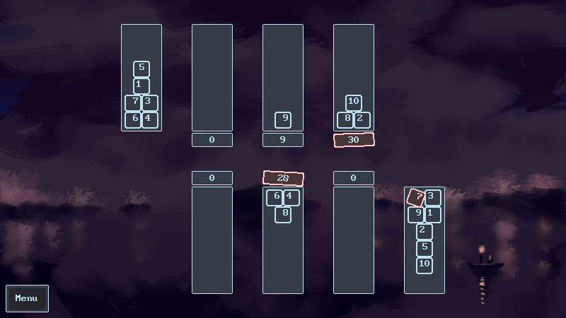

---
draft:
date: 2026-01-16
---

>https://will-pettifer.itch.io/antsim

This is a simple card game! Click <a href='/site/games/caravan/caravan.html' target=blank>here</a> to play in-browser.
### Rules
The players compete to sell as many lots as they can. They take it in turns either moving a card from their caravan into one of their three lots, or moving a card from one lot to another. If 2 cards add up to 10, they add up to 20. The game ends when there is one valid lot at each of the three trading posts. Valid lots are:

- From 25 to 30, inclusive, and higher than the opposing lot, or,
- Exactly 5 below the opposing lot.

Lots that are 5 below always win.

The winner is whoever sold the most lots.

### Implementation
The game, made in the Godot engine, uses a very simple recursive search function with a depth of 1 or 3 to find the best move.