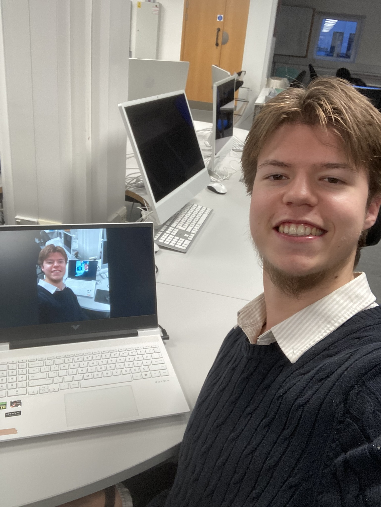

I come from the West Midlands, and am currently studying Computer Games Technology at the University of Portsmouth. I began learning to code in the spring of 2023, starting out with Unity and C#. While at university, I have completed projects using Unreal Engine, Godot, OpenGL, etc. I have long been interested in games as an emerging art form, and I thoroughly enjoy the challenge and intrigue involved in games programming, from the abstract mathematics to the implementation of specific systems and mechanics.

Aside from making games, I enjoy reading books of philosophy, economics, and theology.

